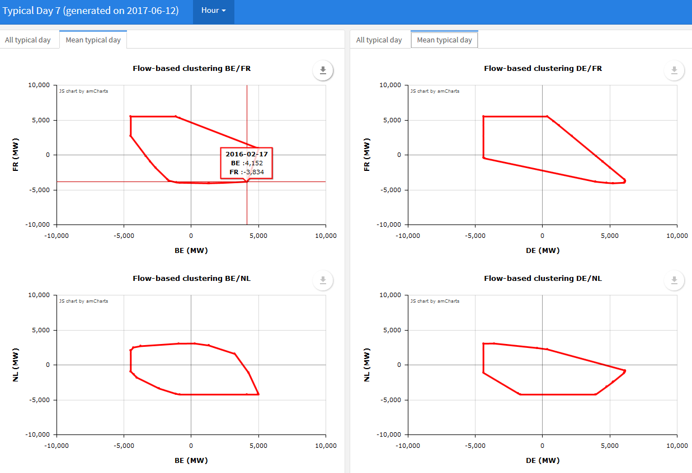

```{r setup, include=FALSE}
knitr::opts_chunk$set(echo = TRUE)
require(flowBasedClustering)
```

``flowBasedClustering`` allows to cluster and visualize typical-days of **flow-based** domains.


## 1 - Summary

```{r, eval=FALSE}

# Generate calendar
dates <- getSequence("2015-11-01", "2017-01-20")
interSeasonBegin <- c("2016-03-01", "2016-10-01")
interSeasonEnd <- c("2016-05-15", "2016-10-31")
# Define a calendar with season
calendar <- getCalendar(dates, interSeasonBegin, interSeasonEnd)

# Transform PTDF data to vertices
vertices <- ptdfToVertices(PTDF = "faceAllYear.csv", nbCore = 4)

# Cluster the typical days
clusterTD <- clusteringTypicalDays(calendar, vertices, nbClustWeek = 3, 
                      nbClustWeekend = 1, report = TRUE)

# Get probabilities and quantiles from climate file in order to classify the typical days
climat <- fread(system.file("dev/Climat.txt",package = "flowBasedClustering"))
getProbability <- function(climat, classif = clusterTD, levelsProba = c(0.333, 0.666)
```

## 2 - Calendar

First, the function ``getSequence()`` can be used to build a vector of consecutive dates.

```{r, eval = TRUE}
# Specify a repository
getSequence("2015-11-01", "2015-11-05")
```

Then, we define the calendar data wanted and needed for the clustering using ``getCalendar()``. It uses the main following parameters : 

* ``dates`` : vector of dates (YYYY-MM-DD)
* ``interSeasonBegin`` : date, YYYY-MM-DD, begin of interseason
* ``interSeasonEnd`` : date, YYYY-MM-DD, end of interseason
* ``dayInWeekend`` : indice of weekend day. Default to ``c(6,7) (=) saturday and sunday``
* ``dayExclude`` : date, YYYY-MM-DD, day to exclude (e.g. due to poor quality data)
* ``holiday`` : a ``timeDate`` object to identify holidays, which will be classified in the same category as weekends.


The function returns a list with date for **week-end** and **working days** for both **interseason**, **winter** and **summer**.

```{r, eval = TRUE}
dates <- getSequence("2017-01-01", "2017-12-31")
interSeasonBegin <- c("2017-03-01", "2017-09-01")
interSeasonEnd <- c("2017-05-01", "2017-11-01")
cal <- getCalendar(dates, interSeasonBegin, interSeasonEnd)
str(cal)
```

## 3 - PTDF to vertices

The function ``ptdfToVertices()`` transforms a PTDF file to vertices data. This computation can be quiet expansive, and so be done in parallel.

* ``PTDF`` : path for PTDF file
* ``nbCore`` : number of cores for parallel computation. Default to one

The PTDF file must contains at least these seven columns *Date*, *Period*, *BE*, *DE*, *FR*, *NL*, *RAM_0* **in this order**    :


```{r, eval = FALSE}
ptdf_data <- fread(system.file("dev/data/faceAllYear.csv",package = "flowBasedClustering"),
                   data.table = F)
head(ptdf_data[, 1:7])
```

And the result is a ``data.table`` which contains vertices.

```{r, eval = TRUE, echo = FALSE}
vertices <- data.table::fread(system.file("dev/verticesAllDay.txt",package = "flowBasedClustering"))
head(vertices)
```


## 4 - Clustering of typical days

Once we have our **vertices** and our **calendar**, we can launch the clustering with ``clusteringTypicalDays()``. We can set the number of clusters in week days and week-end with ``nbClustWeek`` and ``nbClustWeekend`` and build a report using ``report`` and  ``reportPath``.


```{r, echo = TRUE, eval = FALSE}
clusterTD <- clusteringTypicalDays(calendar, vertices, nbClustWeek = 3, nbClustWeekend = 1,
                              report = TRUE)

```

You can also use the output of ``clusteringTypicalDays()`` to generate report later for one or more day type using ``generateClusteringReport()``, or just plot several graphic with ``clusterPlot()`` : 

```{r, echo = FALSE}
clusterTD <- readRDS(system.file("dev/ClassifOut.RDS",package = "flowBasedClustering"))
```

```{r, eval = FALSE}
# build report for one typical day
generateClusteringReport(dayType = 7, data = clusterTD)
```

<div style="text-align:center" markdown="1">

</div>

<div style="text-align:center" markdown="1">

</div>

With ``clusterPlot()``, one can choose 2 countries (``country1`` & ``country2``), the ``hour`` and the ``dayType``. In options, you can decide to plot only the typical day (``typicalDayOnly``) and use static or dynamic visualization (``ggplot``)

```{r, echo = TRUE, fig.width= 7, fig.height= 4.5, warning=FALSE}
# static graphic
clusterPlot(clusterTD, country1 = "FR", country2 = "DE", 
            hour = 8, dayType = 9, typicalDayOnly = FALSE, ggplot = TRUE)
```

```{r, echo = TRUE}
# dynamic graphic
clusterPlot(clusterTD, country1 = "FR", country2 = "DE", 
            hour = 8, dayType = 9, typicalDayOnly = TRUE, ggplot = FALSE)
```

## 5 - Probabilities and quantiles

Finally, the function ``getProbability()`` can be used to learn the correlations between the occurences of the different clusters and external data (typically climatic data). 

* ``climat`` : climate file, 2 first columns are Date and Period, others are exogenous variables (e.g. wind speed and temperature)
* ``classif`` : output of ``clusteringTypicalDays()``

The quantiles are set with ``levelsProba``, and can be : 

* the same for all exogenous variables using a ``numeric vector``
* set for each climate variable using a ``named list``


```{r, echo = TRUE, eval = FALSE}
# same quantiles for each variables 
MatProb <- getProbability(climat, clusterTD, levelsProba = c(0.333, 0.666))

# diffents quantiles for each variables 
levelsProba <- list(`Conso (J-1)` = c(0.2, 0.8), DE_wind = c(0.3, 0.7),DE_solar = c(0.3,0.4,0.8))
MatProb <- getProbability(climat, clusterTD, levelsProba = levelsProba)
```
