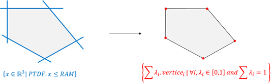

```{r setup, include=FALSE}
knitr::opts_chunk$set(echo = TRUE)
require(flowBasedClustering)
```

``flowBasedClustering`` allows to cluster typical **flow-based** days and to visualize their domains.


## 1 - Summary

```{r, eval=FALSE}

# Define a calendar (period on which the clustering will be made + distinction of each season)
dates <- getSequence("2015-11-01", "2017-01-20")
interSeasonBegin <- c("2016-03-01", "2016-10-01")
interSeasonEnd <- c("2016-05-15", "2016-10-31")
calendar <- getCalendar(dates, interSeasonBegin, interSeasonEnd)

# Identify PTDF in a csv file
ptdf_file_path <- system.file("dataset/ptdf_example.csv", package = "flowBasedClustering")
# (note : this small dataset does not span on all the calendar defined above)

# Transform PTDF data to vertices
vertices <- ptdfToVertices(PTDF = ptdf_file_path, nbCore = 4)

# Cluster the typical days
clusterTD <- clusteringTypicalDays(calendar, vertices, nbClustWeek = 3, 
                      nbClustWeekend = 1, report = TRUE)

# Get probabilities and quantiles from climate file in order to classify the typical days
climate <- fread(system.file("dataset/climate_example.txt",package = "flowBasedClustering"))
probMatrix <- getProbability(climate, cluster = clusterTD, levelsProba = c(1/3, 2*3))
```

## 2 - Calendar definition

First, the function ``getSequence()`` can be used to build a vector of consecutive dates.

```{r, eval = TRUE}
getSequence("2015-11-01", "2015-11-05")
```

On this period, the different seasons (winter, summer and interseason) can be identified using the ``getCalendar()`` function. It uses the main following parameters : 

* ``dates`` : vector of dates (``YYYY-MM-DD``)
* ``interSeasonBegin`` : vector of dates (``YYYY-MM-DD``) beginning the interseasons
* ``interSeasonEnd`` :  vector of dates (``YYYY-MM-DD``) ending the interseasons
* ``dayInWeekend`` : indices of week days identified as week-end. Default to ``c(6,7) (=) saturday and sunday``
* ``dayExclude`` : vector of dates (``YYYY-MM-DD``) which will be excludes from the calendar (e.g. due to poor quality data)
* ``holiday`` : a ``timeDate`` object to identify bank holidays, which will be classified in the same category as weekends.


The function returns a list with vectors of dates for **week-end** and **working days** for both **interseason**, **winter** and **summer**.

```{r, eval = TRUE}
dates <- getSequence("2017-01-01", "2017-12-31")
interSeasonBegin <- c("2017-03-01", "2017-09-01")
interSeasonEnd <- c("2017-05-01", "2017-11-01")
cal <- getCalendar(dates, interSeasonBegin, interSeasonEnd)
str(cal)
```

## 3 - PTDF to vertices

PTDF are the equations of the hyperplanes defining the limits of the domain, while the vertices are the coordinnates of the extreme points of the domain.



The function ``ptdfToVertices()`` transforms a PTDF file to vertices data. This computation can take some time, and so the function allows to do it on several threads.

* ``PTDF`` : path for PTDF file
* ``nbCore`` : number of cores for parallel computation. Default to one

The PTDF file must contains at least these seven columns ``Date``, ``Period``, ``BE``, ``DE``, ``FR``, ``NL``, ``RAM`` **in this order**    :


```{r, eval = TRUE, echo = FALSE}
ptdf_data <- data.table::fread(system.file("dataset/ptdf_example.csv",package = "flowBasedClustering"),
                   data.table = F)
head(ptdf_data[, 1:7])
```

And the result is a ``data.table`` which contains vertices.

```{r, eval = TRUE, echo = FALSE}
vertices <- data.table::fread(system.file("dataset/vertices_example.txt",package = "flowBasedClustering"))
head(vertices)
```


## 4 - Clustering of typical days

Once we have the **vertices** and the **calendar**, the clustering algorithm can be run with the function ``clusteringTypicalDays()``. The number of clusters of the different day categories (week days and week-end) can be set with ``nbClustWeek`` and ``nbClustWeekend``. A report can be automaticcaly built using ``report`` and ``reportPath`` arguments.


```{r, echo = TRUE, eval = FALSE}
clusterTD <- clusteringTypicalDays(calendar, vertices, nbClustWeek = 3, nbClustWeekend = 1,
                              report = TRUE)

```

One can also use the output of ``clusteringTypicalDays()`` to generate report later for one or more typical day(s) using ``generateClusteringReport()``, or just plot domains with ``clusterPlot()`` : 

```{r, echo = FALSE}
clusterTD <- readRDS(system.file("dataset/cluster_example.RDS",package = "flowBasedClustering"))
```

```{r, eval = FALSE}
# build report for one typical day
generateClusteringReport(dayType = 7, data = clusterTD)
```

<div style="text-align:center" markdown="1">

</div>

<div style="text-align:center" markdown="1">

</div>

With ``clusterPlot()``, one can choose 2 countries (``country1`` & ``country2``), the ``hour`` and the ``dayType`` (i.e. typical day identifer). In options, it can be decided whether to plot only the typical day (``typicalDayOnly``) or the full cluster and whether to use static or dynamic visualization (``ggplot``)

```{r, echo = TRUE, fig.width= 7, fig.height= 4.5, warning=FALSE}
# static graphic
clusterPlot(clusterTD, country1 = "FR", country2 = "DE", 
            hour = 8, dayType = 9, typicalDayOnly = FALSE, ggplot = TRUE)
```

```{r, echo = TRUE}
# dynamic graphic
clusterPlot(clusterTD, country1 = "FR", country2 = "DE", 
            hour = 8, dayType = 9, typicalDayOnly = TRUE, ggplot = FALSE)
```

## 5 - Probabilities and quantiles

Finally, the function ``getProbability()`` can be used to learn the correlations between the occurences of the different clusters and external data (typically climatic data). 

* ``climate`` : climate file, the first column is the ``Date`` (``YYYY-MM-DD``), other columns are exogenous variables (e.g. wind speed and temperature)
* ``cluster`` : output of ``clusteringTypicalDays()``

Below, an example of a climate file :
```{r, eval = TRUE, echo = FALSE}
vertices <- data.table::fread(system.file("dataset/climate_example.txt",package = "flowBasedClustering"))
head(vertices)
```

The quantiles are set with ``levelsProba``, and can be : 

* the same for all exogenous variables using a ``numeric vector``
* set for each climate variable using a ``named list``


```{r, echo = TRUE, eval = FALSE}
# same quantiles for each variables 
MatProb <- getProbability(climate, clusterTD, levelsProba = c(1/3, 2/3))

# diffents quantiles for each variables 
levelsProba <- list(`Conso (J-1)` = c(0.2, 0.8), DE_wind = c(0.3, 0.7),DE_solar = c(0.3,0.4,0.8))
MatProb <- getProbability(climate, clusterTD, levelsProba = levelsProba)
```
